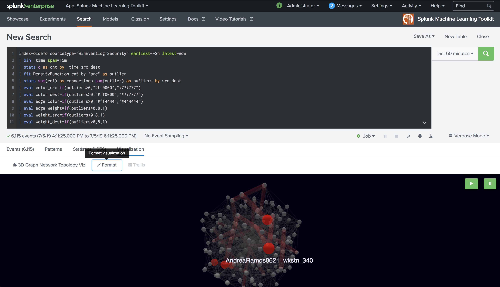
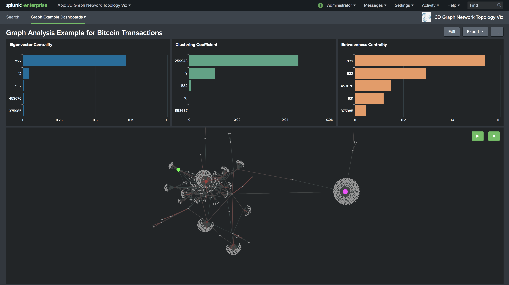
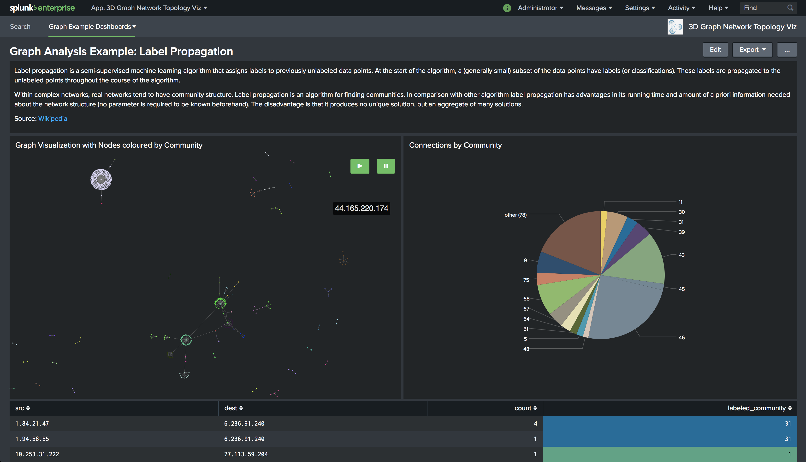

# Splunk 3D Graph Network Topology Visualization


[](https://github.com/splunk/splunk-3D-graph-network-topology-viz/actions?query=workflow%3A"CI")
[](https://github.com/splunk/splunk-3D-graph-network-topology-viz/releases)
[](LICENSE)

Plot relationships between objects with force directed graph based on ThreeJS/WebGL.

More information around use cases on the following Splunk blogs:
- [Chasing a Hidden Gem: Graph Analytics with Splunk’s Machine Learning Toolkit](https://www.splunk.com/en_us/blog/machine-learning/chasing-a-hidden-gem-graph-analytics-with-splunk-s-machine-learning-toolkit.html)
- Understanding and baselining network behaviour [[part 1](https://www.splunk.com/en_us/blog/machine-learning/understanding-and-baselining-network-behaviour-using-machine-learning-part-i.html) /  [part 2](https://www.splunk.com/en_us/blog/machine-learning/understanding-and-baselining-network-behaviour-using-machine-learning-part-ii.html)]

## Installation
Please refer to [Splunk Documentation](https://docs.splunk.com/Documentation/AddOns/released/Overview/Installingadd-ons) for guidance on installing this visualization in your environment. The app needs to be installed on the SH tier.

Download is available from either [GitHub](https://github.com/splunk/splunk-3D-graph-network-topology-viz/releases) or [Splunkbase](https://splunkbase.splunk.com/app/4611/).

## Usage
`<search> | stats count by src dest [color_src] [color_dest] [edge_color] [weight_src] [weight_dest] [edge_weigth]`

Replace `src` and `dest` with your fields to start. All other fields are optional and default values will be used if not given.

### Optional values
Used to customise nodes and edges (or links) styling.

| FieldName     | Format  | Description                           | Example   |
|---------------|---------|---------------------------------------|-----------|
| `color_src`   | string  | Color of source node in HEX           | `#00DD00` |
| `color_dest`  | string  | Color of destination node in HEX      | `#CC00FF` |
| `edge_color`  | string  | Color of edge in HEX                  | `#12FF00` |
| `weight_src`  | numeric | Sphere size of source node            | `2.5`     |
| `weight_dest` | numeric | Sphere size of destination node       | `3`       |
| `edge_weight` | numeric | Stroke weight of edge line in pixels  | `2.1`     |

Besides:
* Field names **must** correspond to the ones specified above to be properly handled by the visualization
* Any `edge_weight` value higher than `18` will be normalised to `18`

## Examples


### Lookup tables
* Add a lookup table defining these additional values to your Splunk instance. An example below:

    ```
    $~ cat <your_lookup_table>.csv
    source,color,weight
    A,#010101,50
    B,#ff0101,10
    ...
    ```

* Execute your SPL
    `<search> | stats count by src dest | lookup <your_lookup_table> source AS src | lookup <your_lookup_table> source AS dest OUTPUTNEW color AS color_dest, weight AS weight_dest`

### Simple SPL
* Execute your SPL
    `<search> | stats count as edge_weight by src dest | eval color_src="#cc0000", color_dest="#00ff00", weight_src=3 | eval edge_color=if(edge_weight < 18, "#0000cc","")`



## Graph Algorithm Examples

Four dashboards are provided to show graph algorithms in action using NetworkX. Select them by clicking on `Graph Example Dashboards` dropdown in the app navigation bar.

### Requirements
Make sure you have the following Splunk apps installed in your instance to correctly visualize integrated dashboards.
* [Splunk's Machine Learning Toolkit (MLTK)](https://splunkbase.splunk.com/app/2890)
* [Python for Scientific Computing Libraries 2.0](https://splunkbase.splunk.com/app/2882/) or later

> Give **global** permissions to MLTK app if not already done 





## Hardware Acceleration in Browsers
All modern browsers shall have hardware acceleration turned on by default in order to increase your browser performance and free up CPU by leaving the GPU (Graphics Processing Unit) handling graphical intensive operations.

### Chrome
The best way to check whether hardware acceleration is turned on is to type `chrome://gpu` into the address bar at the top of the browser.

A whole bunch of results will be returned but we're interested on the section titled _Graphics Feature Status_. Please make sure "Hardware accelerated" is turned on entry WebGL (among multiple others).

To enable hardware acceleration:
* type `chrome://settings` in the address bar,
* scroll to the very bottom of that page and expand the _Advanced_ link
* scroll down till reaching the section _System_ and enable the option "Use hardware acceleration when available"
* restart the browser if requested

### Firefox
To enable hardware acceleration:
* type `about:config` in the address bar
* search for `layers.acceleration.force-enabled` and double click on it to turn the value to `true`
* restart the browser

### Other browsers
For other browsers, please refer to their specific documentation on the matter.

## Contributing
If you would like to contribute to the visualization, please have a look at our [Contribution Guide](CONTRIBUTING.md)

## LICENSE
Splunk 3D Graph Network Topology Visualization is licensed under the Apache License 2.0. Details can be found in the file [LICENSE](LICENSE).