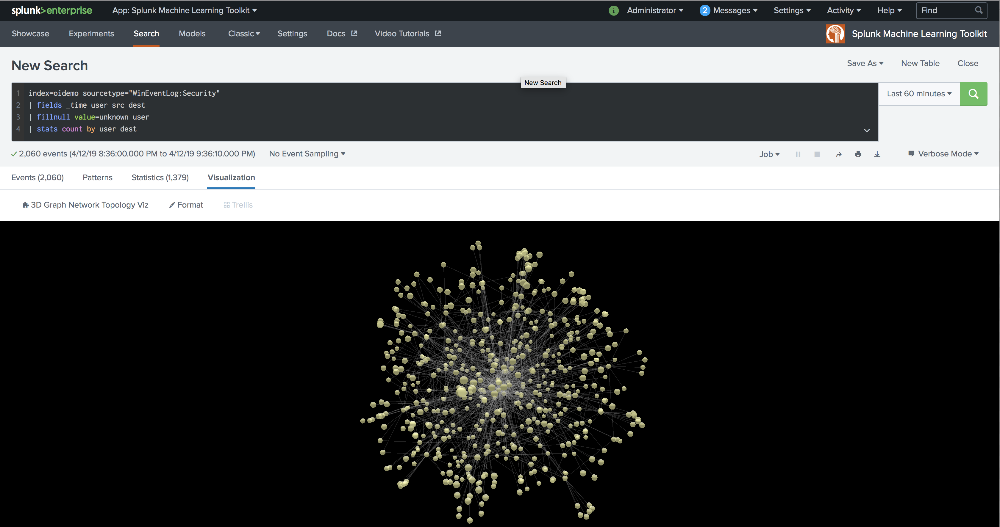
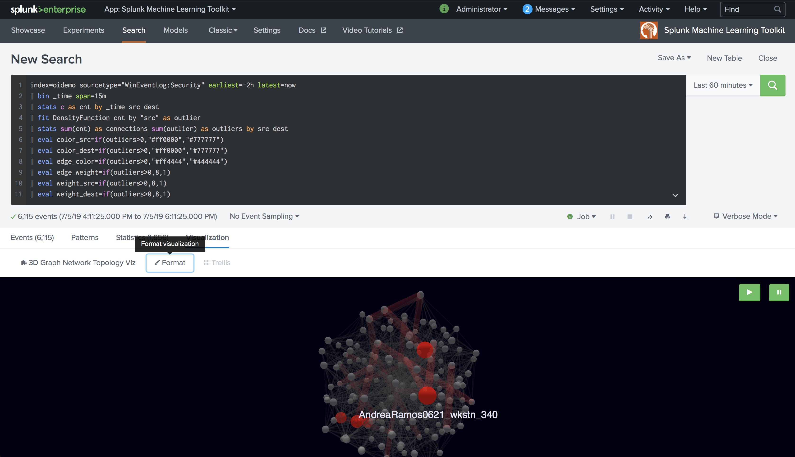
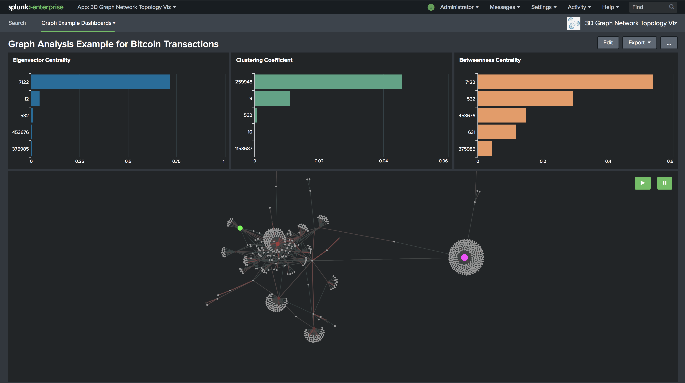
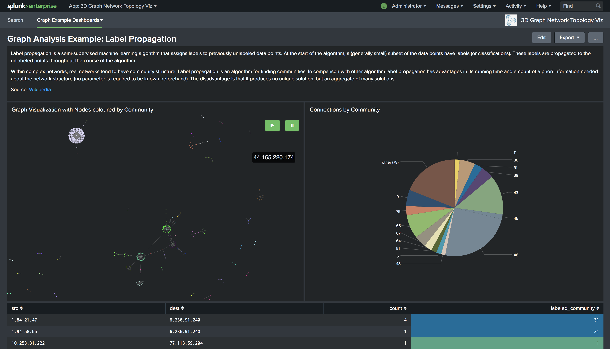

# Splunk 3D Graph Network Topology Visualization

Plot relationships between objects with force directed graph based on ThreeJS/WebGL.

## Installation

- [Download Splunk for your platform](http://www.splunk.com/download?r=productOverview).
- Unpack/Install Splunk by running the downloaded files.
- Follow the instruction on the screen.

Splunk-3d-graph-network-topology-viz can be downloaded from either **github** or [splunkbase](https://splunkbase.splunk.com/app/4611/) and installed in your Splunk platform. Access your Splunk instance via terminal and:
- browse to your apps directory `$SPLUNK_HOME/etc/apps/`
- download the app from github `git clone  https://github.com/splunk/splunk-3d-graph-network-topology-viz.git`
- Restart splunk to apply changes `$SPLUNK_HOME/bin/splunk restart`

## Usage
`<search> | stats count by src dest [color_src] [color_dest] [edge_color] [weight_src] [weight_dest] [edge_weigth]`

Replace `src` and `dest` with your fields to start. All other fields are optional and default values will be used if not given.

### Optional values
Used to customise nodes and edges (or links) styling.

| FieldName     | Format  | Description                           | Example   |
|---------------|---------|---------------------------------------|-----------|
| `color_src`   | string  | Color of source node in HEX           | `#00DD00` |
| `color_dest`  | string  | Color of destination node in HEX      | `#CC00FF` |
| `edge_color`  | string  | Color of edge in HEX                  | `#12FF00` |
| `weight_src`  | numeric | Sphere size of source node            | `2.5`     |
| `weight_dest` | numeric | Sphere size of destination node       | `3`       |
| `edge_weight` | numeric | Stroke weight of edge line in pixels  | `2.1`     |

Besides:
* Field names **must** correspond to the ones specified above to be properly handled by the visualization
* Any `edge_weight` value higher than `18` will be normalised to `18`

## Examples


### Lookup tables
* Add a lookup table defining these additional values to your Splunk instance. An example below:

    ```
    $~ cat <your_lookup_table>.csv
    source,color,weight
    A,#010101,50
    B,#ff0101,10
    ...
    ```

* Execute your SPL
    `<search> | stats count by src dest | lookup <your_lookup_table> source AS src | lookup <your_lookup_table> source AS dest OUTPUTNEW color AS color_dest, weight AS weight_dest`

### Simple SPL
* Execute your SPL
    `<search> | stats count as edge_weight by src dest | eval color_src="#cc0000", color_dest="#00ff00", weight_src=3 | eval edge_color=if(edge_weight < 18, "#0000cc","")`



## Graph Algorithm Examples

Four dashboards are provided to show graph algorithms in action using NetworkX. Select them by clicking on `Graph Example Dashboards` dropdown in the app navigation bar.

### Requirements
Make sure you have the following Splunk apps installed in your instance to correctly visualize integrated dashboards.
* [Splunk's Machine Learning Toolkit (MLTK)](https://splunkbase.splunk.com/app/2890)
* [Python for Scientific Computing Libraries 2.0](https://splunkbase.splunk.com/app/2882/) or later

> Give **global** permissions to MLTK app if not already done 





## Contributing
If you would like to contribute to the visualization, please have a look at our [Contribution Guide](CONTRIBUTING.md)

## LICENSE
Splunk 3D Graph Network Topology Visualization is licensed under the Apache License 2.0. Details can be found in the file [LICENSE](LICENSE).